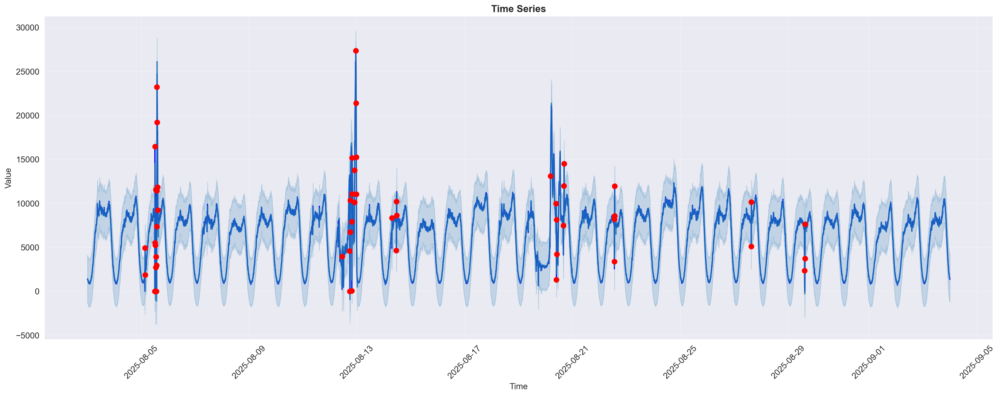

# Детекция аномалий на временных рядах

Демонстрационный проект по обнаружению аномалий во временных рядах с использованием статистических методов и авторегрессионных моделей.



## Описание

Данный проект представляет собой Jupyter ноутбук, демонстрирующий полный пайплайн детекции аномалий на временных рядах. Проект включает в себя предобработку данных, применение различных статистических методов и визуализацию результатов.


## Установка и запуск

### Установка зависимостей

#### Вариант 1: С использованием pip

```bash
# Создание виртуального окружения
python -m venv venv

# Активация окружения
source venv/bin/activate

# Установка зависимостей
pip install -r requirements.txt
```

#### Вариант 2: С использованием uv (рекомендуется)

```bash
# Установка uv (если не установлен)
curl -LsSf https://astral.sh/uv/install.sh | sh

# Синхронизация зависимостей
uv sync
```

### Запуск

```bash
jupyter notebook anomaly_detection.ipynb
```
